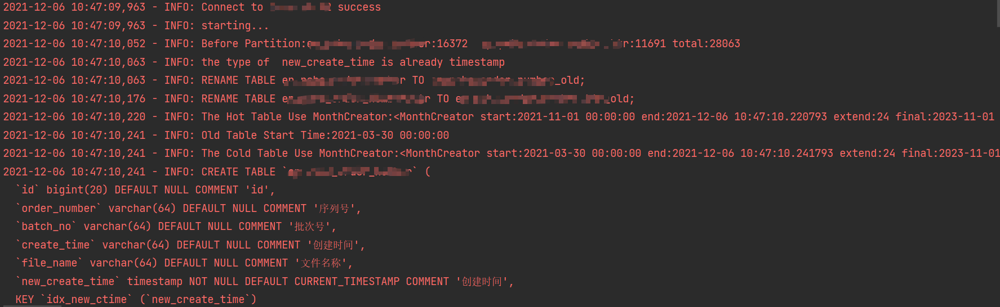
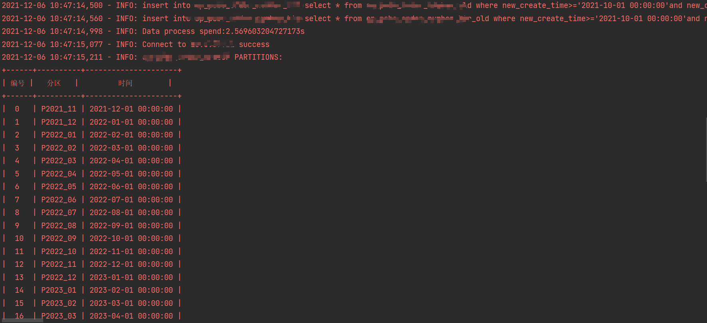
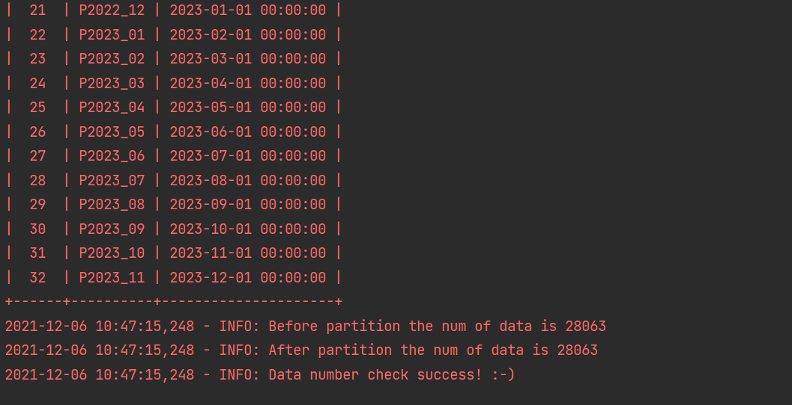

# MysqlPartition
用于按照月份创建mysql分区表，输入原表，自动创建分区表，程序会创建两个分区表，用于归档使用，
可自定义热表的保留月份，自带数据导入功能并支持多线程和单线程。源数据可以来自一个表，也可以来自两个表(如之前有归档表)  

注意：
1. 如果使用了唯一索引由于分区表特性，唯一索引会失效
2. 操作之前确保空间足够，为了保证安全本程序不会删除数据，而是会将源表重命名，如空间够会
导致失败

使用方式如demo和demo2所示  
由于使用分区表的场景为大表，所以可能重建分区表的大部分时间为数据导入  
demo
```python
from creator import Creator

if __name__ == '__main__':

    with Creator(host="127.0.0.1", username="user", password="pwd", db="xxx",
                 table="xxx",extend_partition=24,

                 bak_table="xxx",
                 is_test=False, mul_thread=False, hot_table_month=3,part_col="new_create_time"
                 ) as c:
        c.run()

```
参数说明：  
 host,username,password,db，port为连接信息，不需要解释  
 part_col为分区字段  
 hot_table_month为给热表保留多少个月的数据  
 table，bak_table 分别为导入数据时候的热表和冷表，如无冷表可不填  
 new_bak_table_tail 新归档表的尾部名称  
 is_test 是否为测试模式，测试模式仅打印sql语句，并不执行  
 mul_thread 是否开启多线程模式，多线程为按月导入  
 extend_partition 创建多少个月的分区(会自动查找数据中的时间)  
日志输出如下



